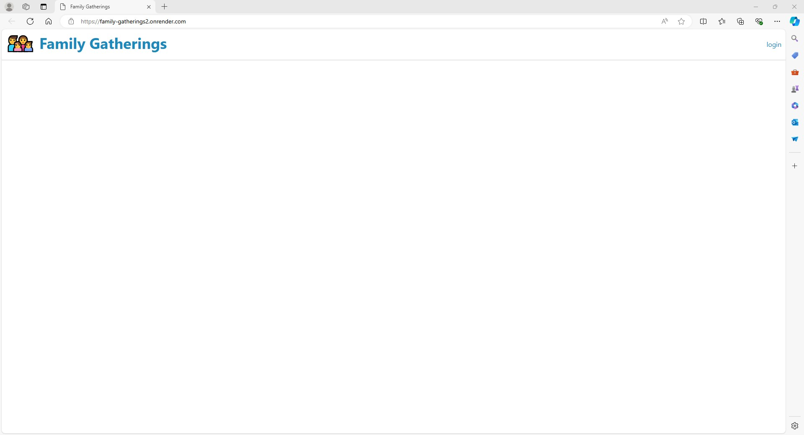

# Family-Gatherings

## Description

Tired of the same old social media? Tired of these apps selling your data to the highest bidder? Want to reconnect with family all in one place, and ad free? 
Family-Gatherings was built to bring back those personal connections we all need and desire; ad free, secure all in one place. Post, share, connect with your family online from the comfort of home, or on the go. Keep track of events using the built in calendar feature that is shared amongst the family. Ready to connect with loved ones online all in one place? Then go to Family-Gatherings.com  Keeping your family in mind, stay connected.

## Table of Contents

[Installation](#installation)
 
[Usage](#usage)
 
[Technologies](#technologies)
 
[License](#license)
 
[Questions](#questions)
 

## Installation

No install required just go to our site here [Family-Gatherings](https://family-gatherings2.onrender.com/)
 

## Usage

Just sign up, create or join a family and connect with your loved ones online.

## Technologies

Technologies we used include the following:
 
bcrypt 5.0.0
 
connect-session-sequelize 7.0.4
 
dotenv 8.2.0
 
express 4.17.1
 
express-handlebars 5.2.0
 
express-session 1.17.1
 
pg 8.11.3
 
sequelize 6.3.5

## License
    This project is covered under the MIT license.
[License Link](https://opensource.org/licenses/MIT)

## Questions
Dev's GitHubs Profiles:
[Jerry Sparling](https://github.com/Jrsparling), 
[Ted Whitson](https://github.com/tedwhitson),
[Carson Denning](https://github.com/denningcars),
[Louis Drippe](https://github.com/Dark-N-Oak)
